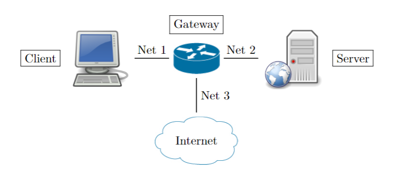

This project contains mainly three virtual machines namely, server, gateway and client. Gateway is the machine which has access to the internet. 
This setup resembles any network in general. Server side network is considered as the internal network and client side network is considered as the outside network which 
contains any user/attacker possibly. The following diagram shows the architecture of the network.



Create a ubuntu virtual machine using Virtual Box. The network settings should be as follows:

All the vms should contain promiscous mode as "Allow All"
For Client:


As shown above, in Attached to, give the option as "Internal Network" and give a name for that network. I have given it as "client-net". CLient vm has only one adapter as it is directly connected to the gateway. 

For Server:


Follow the same steps as server but the name should be different as both server and client are in different networks. For the name, I gave it as "server-net".

For Gateway:

For Gateway, it is little different as it will be having 3 adapters each with server, client, and the outside internet. For adapter one, give the name same as that of clients network adapter after choosing "Attached to" as "Internal Network". And remaining options are same.


For adapter 2, let's say it connects to the server, choose the "Attached to" as "Internal Network" and the name is same as that of server's adatper.


For adapter 3, it connects to the internet. Choose the "Attached to" as "NAT Network". By default there is a NAT Network defined in the virtual box. To view it, close the current window. Go to File->Preferences. In the opened window, click on the Network section. In it there is default network as shown below. If you could not see it, create one. If you open the settings of it, you can see the CIDR IP address range given in it.


Until here, only external settings are given. Until and unless the actual configurations are made after switching on the machines, the network will not work properly. Now switch on the machines and follow along.

**Client Setup:**
From the command line, enter following command to get the interfaces available. '-a' option allows to output the inavailable network interfaces as well.
> ifconifg -a

Here the previously given network adapter as interface and if you want, you can check the MAC address given with the one in the settings.As there are no IP addresses previously, it will not show the IP address. To assign an IP address to the interface,  enter the following command:
> sudo ifconfig enps03 192.168.0.10/24 netmask 255.255.255.0 up

enp0s3 is the name of the interface from the ifconfig command. It could vary from system to system. The newly assigned IP is 192.168.0.10

Next step is to add a default gateway to the client. Whenever it needs to send a packet to a host in a remote network, it will send the packet to a default gateway. To add the gateway, enter the following command:
> sudo route add default gw 192.168.0.100

Note that we need to give the Gateway's ip address as 192.168.0.100. To confirm that the default gateway got set correctly, enter the following command and check whether the first line contains the ip address of the gateway.
> route -n


The setup is complete. However, these network changes are not permanent. They will change to default values once the machines are restarted. In order to avoid that, the default configuration file in "/etc/netplan" folder needs to edited. To open,
> sudo vim /etc/netplan/01-netcfg.yaml

Add the following content:
```
network:
  version: 2
  renderer: networkd
  ethernets:
    enp0s3:
      dhcp4: no
      addresses:
        - 192.168.0.10/24
      gateway4: 192.168.0.100
      nameservers:
        addresses: [8.8.8.8, 8.8.4.4]
```
The yaml file should be edited correctly. The indentation should be followed appropriately otherwise might run into issues.
To enable the configurations, enter the following command:
> sudo netplan apply

If it runs into any errors, run the same command with option -d to have debug information.

**Gateway Setup:**

The process is similar to that of client with a little changes as there are three interfaces to configure on gateway. After giving `ifconfig -a`, you should see three interfaces without any IP addresses being set. Using the following commands to configure the IP addresses on the client-side and server-side networks.

```
sudo ifconfig enp0s3 192.168.0.100 netmask 255.255.255.0 up
sudo ifconfig enp0s8 10.0.0.100 netmask 255.0.0.0 up
```

To check which interface is that of which network, you can look at the MAC addresses in the network settings you had set up previously. If you look at the screenshots of gateways above, you can see the MAC address for that adapter. Compare that with ifconfig output on gateway.

For example, in the following output, the highlighted MAC address matches with the MAC address from the client-net settings. So, the interface with name as "enp0s3" is the client-side network interface on the gateway.


One more interface is remaining. That is for the NAT network. As that is the interface that enables the gateway to access the outside network, DHCP client is enabled on it using the following command:

> sudo dhclient enp0s9

Now if you give the ifconfig command, you can see the ip address automatically assigned to the third interface.

Again, the assignment is not permanent. So it can be made permananent by adding the following content to /etc/netplan/01-netcfg.yaml

```
network:
  version: 2
  renderer: networkd
  ethernets:
    enp0s3:
      dhcp4: no
      addresses:
        - 192.168.0.100/24
      nameservers:
        addresses: [8.8.8.8, 8.8.4.4]
    enp0s9:
      dhcp4: yes
      nameservers:
        addresses: [8.8.8.8, 8.8.4.4]
    enp0s8:
      dhcp4: no
      addresses:
        - 10.0.0.100/8
      nameservers:
        addresses: [8.8.8.8, 8.8.4.4]
```

After saving the file with above content, to apply the configuration, give the following command:
> sudo netplan -d appy

